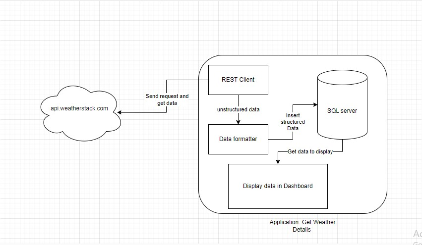

# Realtime Weather Monitoring Project

## Project Architecture

## Introduction
This project is a real-time weather monitoring application that retrieves and displays current weather data for specified locations. The application uses weather data APIs to provide accurate and up-to-date weather information.

## Features
- Real-time weather updates
- Current temperature, humidity, and wind speed
- Weather forecasts
- Location-based weather information

## Steps to Run Project 
- install jar in your local system
- after that create Database by using weather_schema.txt file
- open cmd at your jar file directory
- run "java -jar readFile-0.0.3-SNAPSHOT.jar config.json"
- which get data from #open wether website
- and add it to your databse

## If u want more details 
- msg me on email : atrcpit2pk@gmail.com
